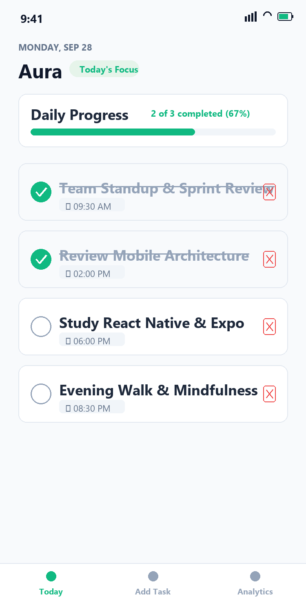
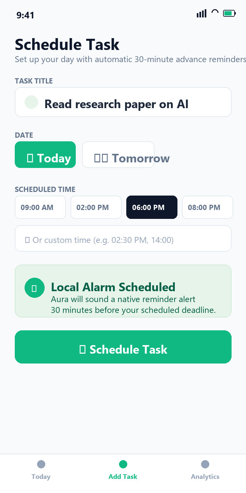

# Aura

Aura is a mobile habit and productivity tracking application designed to help individuals structure their daily workflow, maintain consistent routines, and track time-sensitive commitments. Built with React Native and Expo, Aura emphasizes a clean, distraction-free user experience, robust offline persistence, and automated proactive reminders.

---

## Application Preview

<div align="center">
  <table>
    <tr>
      <td align="center" width="50%">
        <strong>Today's Agenda</strong>
      </td>
      <td align="center" width="50%">
        <strong>Task Scheduling & Alarms</strong>
      </td>
    </tr>
    <tr>
      <td align="center" valign="top">
        
      </td>
      <td align="center" valign="top">
        
      </td>
    </tr>
    <tr>
      <td align="center">
        <sub>Real-time task tracking with instant completion toggles</sub>
      </td>
      <td align="center">
        <sub>Time-bound scheduling with automated 30-minute advance notifications</sub>
      </td>
    </tr>
  </table>
</div>

---

## Architecture and How It Works

Aura is engineered around three primary design principles:

### 1. User-Directed Task Management
Unlike applications that force pre-configured templates or dummy data, Aura initializes with an entirely clean state. Users define their own tasks, set target dates, and assign specific deadlines. Tasks display immediate visual feedback through status badges and completion styles.

### 2. Proactive Advance Alarms
Time-bound commitments require timely intervention. Aura calculates target trigger times exactly 30 minutes before any scheduled task and queues an operating-system-level notification via `expo-notifications`. Reminders fire reliably regardless of whether the application is active, backgrounded, or closed.

### 3. Local-First Data Sovereignty
All user records are persisted directly on the client device using `@react-native-async-storage/async-storage`. This eliminates network latency, guarantees 100% offline availability, and ensures user data never leaves the device.

---

## Key Features

- **Daily Agenda Dashboard:** Consolidated view of daily tasks, live progress meters, and dynamic completion percentages.
- **Priority Tiering & Sorting:** Classify commitments into High (🔥), Medium (⚡), and Low (🌿) priorities with automatic priority-weighted ordering.
- **Dynamic Agenda Filtering:** Instant filtering on Today's Agenda between All, High Priority, and Pending tasks.
- **Flexible Scheduling:** Dedicated scheduling interface with quick-selection chips for dates (Today, Tomorrow), priority selectors, and preset time blocks, alongside custom time inputs.
- **Interactive State Toggling:** Single-tap completion toggles with smooth visual transitions, dimming, and strike-through formatting.
- **Smart Notification Lifecycle:** Native OS-level 30-minute advance alarms with automatic cancellation when tasks are completed or removed.
- **Discipline Analytics & Backup:** Performance tracking including total tasks managed, completion rates, active-day streak counts, and offline JSON backup verification.
- **Filtered Task History:** Comprehensive review tabs allowing users to inspect all, pending, or completed tasks independently.

---

## Technology Stack

| Layer | Technology | Purpose |
| :--- | :--- | :--- |
| **UI Framework** | React Native (Expo SDK 57) | Cross-platform mobile development (iOS, Android, Web) |
| **Navigation** | React Navigation v7 | Bottom tab routing and screen transition management |
| **Local Storage** | AsyncStorage | Offline key-value task persistence |
| **Alarms & Reminders** | Expo Notifications | OS-level scheduled background alarms and channels |
| **Design & Layout** | React Native Stylesheet | Mobile-first design system with responsive viewport constraints |

---

## Getting Started

### Prerequisites
- Node.js (version 18.0.0 or higher)
- npm (version 9.0.0 or higher) or yarn
- Expo Go mobile application (available on iOS App Store and Google Play Store)

### Installation

1. Clone the repository:
   ```bash
   git clone https://github.com/Aditthan-07/Aura.git
   cd Aura
   ```

2. Install dependencies:
   ```bash
   npm install
   ```

### Execution

- **Development Server (Mobile Devices via Expo Go):**
  ```bash
  npx expo start
  ```
  Scan the QR code displayed in the terminal using Expo Go on Android or the native Camera app on iOS.

- **Web Preview:**
  ```bash
  npx expo start --web
  ```
  Access the mobile preview at `http://localhost:8081`.

---

## License

This project is licensed under the MIT License - see the LICENSE file for details.
